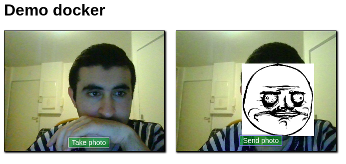

# TP docker:

Lancer la commande **sudo systemctl start docker**

## Docker compose:

Lancer la commande **sudo docker-compose up** pour créer les 4 conteneurs nginx et 1 conteneur de jwilder/nginx-proxy

## dockerfile:

Lancer la commande : **sudo docker build -t camera .** pour créer l'image appelé camera

Lancer la commande : **sudo docker run -tid -p 5050:8080 --name camera_app camera** pour créer un conteneur à partir de l'image camera

Lancer l'application dans le navigateur sur le port 5050: http://localhost:5050/

**Résultat**

